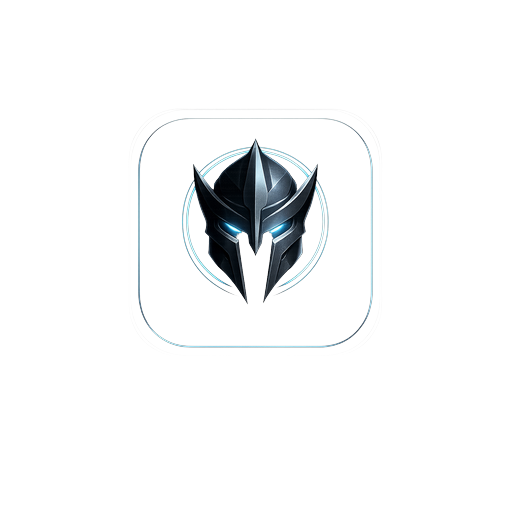

# SETH — Strategic Executive Technology Hub
|
<p align="center">
  
</p>
|

<p align="center">
  <strong>The Operating System for Strategic Executives</strong><br />
  <em>Sovereign AI infrastructure that compounds with every interaction</em>
</p>
|

---
## What is SETH?

SETH replaces the fragmented stack of AI chatbots, human assistants, and productivity tools with a **single sovereign intelligence infrastructure** that sits between an executive and the world.

Unlike consumer AI assistants that reset every session, SETH maintains a **persistent operational context** — memories, behavioral patterns, relationship maps, brand voice profiles, and strategic contradictions — all private, all compounding.

**After 90 days of use, SETH knows your decision patterns, strategic priorities, communication style, and operational rhythm better than any human assistant could. That's not a feature — it's a structural moat.**

---
## Architecture

```
┌─────────────────────────────────────────────────────────┐
│                    SETH PWA Shell                        │
│  Voice Control · Offline Support · Wearable-Ready       │
├─────────────────────────────────────────────────────────┤
│                                                         │
│  ┌──────────┐  ┌──────────┐  ┌──────────┐              │
│  │Executive │  │  Agent   │  │  Cortex  │              │
│  │  Chat    │  │  Swarm   │  │  Intel   │              │
│  │          │  │ 7 agents │  │ Patterns │              │
│  └──────────┘  └──────────┘  └──────────┘              │
│                                                         │
│  ┌──────────┐  ┌──────────┐  ┌──────────┐              │
│  │  Brand   │  │ Browser  │  │  Watch   │              │
│  │ Manager  │  │Automate  │  │  System  │              │
│  │ Ablation │  │ Headless │  │ Proactive│              │
│  └──────────┘  └──────────┘  └──────────┘              │
│                                                         │
│  ┌──────────┐  ┌──────────┐                            │
│  │Environ-  │  │ Unified  │    Multi-Model Routing     │
│  │ ments    │  │Integration│   Venice → OpenRouter      │
│  │          │  │Cal+Gmail │   Privacy-first fallback    │
│  └──────────┘  └──────────┘                            │
│                                                         │
├─────────────────────────────────────────────────────────┤
│  Sovereign Data Store · Evidence-Derived Confidence     │
│  Memory Decay Curves · Relationship Graphs              │
└─────────────────────────────────────────────────────────┘
```

---
## Core Modules

| Module | Description |
|--------|-------------|
| **Executive Chat** | Context-aware AI with strategic memory, voice control, and persistent operational context |
| **Agent Swarm** | 7 specialized agents — Architect, Sentinel, Quartermaster, Navigator, Diplomat, Chronicler, Vanguard |
| **Cortex Intelligence** | Behavioral pattern detection, contradiction alerting, relationship mapping, strategic insights |
| **Brand Manager** | Voice auditing, competitive intel, content strategy with ablation-tested confidence scoring |
| **Browser Automation** | Headless browser engine for data extraction, form submission, web research |
| **Watch System** | Continuous monitoring with autonomous alerting — proactive, not reactive |
| **Environments** | Immersive command interfaces tailored to work context |
| **Integration Layer** | Native Google Calendar, Gmail, and productivity tool integration |

---
## Key Technical Features

- **Multi-Model Routing** — Privacy-first Venice.ai + OpenRouter fallback chain with free/paid tiers
- **Dual-Regime Ablation Testing** — Deterministic (temp=0) observations + stochastic (production temp) statistical verdicts
- **Evidence-Derived Confidence** — Pre-LLM computation: coverage, freshness, anchor strength, conflict penalty
- **Memory Consolidation** — Decay curves with recency × importance, semantic enrichment, entity extraction
- **Structural Conflict Detection** — 4 rule-based heuristics (goals-vs-tasks drift, calendar overload, avoidance patterns, email volume)
- **Context Weighting Profiles** — Per-audit-type weight multipliers with SHA-256 versioned profiles
- **Resilient DB Operations** — Auto-reconnect with retry logic surviving idle-session timeouts
- **Progressive Web App** — Offline-capable service worker, installable, wearable-ready voice pipeline

---
## Getting Started

### Prerequisites

- Node.js 18+
- PostgreSQL database
- API keys for model providers (see `.env.example`)

### Setup

```bash
# Clone the repository
git clone https://github.com/YOUR_USERNAME/seth.git
cd seth

# Install dependencies
yarn install

# Configure environment
cp .env.example .env
# Edit .env with your credentials

# Set up the database
yarn prisma generate
yarn prisma db push

# Seed initial data
yarn ts-node scripts/seed.ts

# Start development server
yarn dev
```

### Environment Variables

See [`.env.example`](.env.example) for all required and optional configuration.

**Required:**
- `DATABASE_URL` — PostgreSQL connection string
- `NEXTAUTH_SECRET` — Session encryption key
- `VENICE_API_KEY` or `OPENROUTER_API_KEY` — At least one model provider

**Optional:**
- `GOOGLE_CLIENT_ID` / `GOOGLE_CLIENT_SECRET` — Google SSO
- `ELEVENLABS_API_KEY` — Voice responses
- `BROWSERLESS_API_TOKEN` — Browser automation
- `SKYBOX_API_KEY` — Environment generation

---
## Deployment

SETH is currently deployed across three surfaces:

| Domain | Purpose |
|--------|---------|
| [sethassistant.digital](https://sethassistant.digital) | Primary product domain |
| [zero-daydynamics.com](https://zero-daydynamics.com) | Corporate / brand domain |
| [jarvisaiassistant.abacusai.app](https://jarvisaiassistant.abacusai.app) | Platform deployment |

---
## Project Structure

```
├── app/                    # Next.js App Router pages & API routes
│   ├── api/               # Backend API endpoints
│   │   ├── brand/         # Brand manager + ablation testing
│   │   ├── chat/          # AI chat with tool execution
│   │   ├── cortex/        # Cognitive intelligence layer
│   │   ├── tasks/         # Task management + auto-execute
│   │   └── ...            # Auth, memories, watches, agents, etc.
│   ├── chat/              # Chat interface
│   ├── brand/             # Brand manager dashboard
│   ├── cortex/            # Cortex intelligence dashboard
│   ├── investors/         # Investor executive summary
│   └── ...                # Tasks, memories, agents, etc.
├── components/            # React components
│   ├── brand/             # Brand manager UI
│   ├── chat/              # Chat interface components
│   ├── dashboard/         # Dashboard shell & navigation
│   └── ui/                # Shared UI primitives
├── lib/                   # Core business logic
│   ├── brand-manager.ts   # Context intelligence engine
│   ├── browser-automate-core.ts  # Headless browser automation
│   ├── cortex.ts          # Cognitive intelligence layer
│   ├── model-router.ts    # Multi-model routing & fallbacks
│   ├── tools.ts           # AI tool definitions & executors
│   └── venice.ts          # System prompt & message building
├── data/                  # Knowledge base documents
├── prisma/                # Database schema
├── scripts/               # Seed scripts
└── public/                # Static assets & PWA manifest
```

---
## Revenue Model

| Tier | Price | Target |
|------|-------|--------|
| **Operator** | $297/mo | Individual executives |
| **Principal** | $997/mo | High-volume executives with custom agents |
| **Enterprise** | Custom | Multi-seat teams with SSO/SAML |

---
## License

Proprietary. All rights reserved.

---
# Trigger redeploySun Jul  5 04:02:33 UTC 2026
